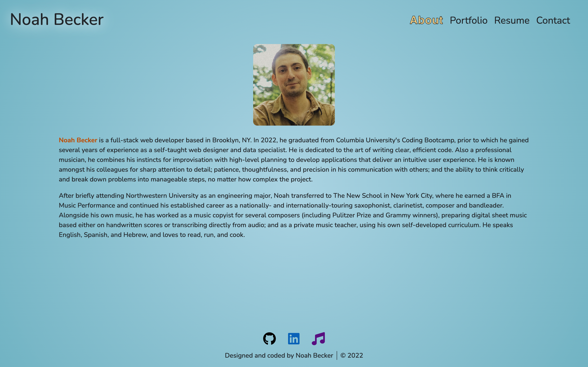

# Portfolio

## Live web application
[https://noah35becker.github.io/portfolio](https://noah35becker.github.io/portfolio)

## Repo
[https://github.com/noah35becker/portfolio](https://github.com/noah35becker/portfolio)

## Description
This is Noah Becker's professional coding portfolio, complete with a bio, work samples, a resume, and contact functionality. It is a single-page application created using React, and incorporates responsive design (adapts to different viewport sizes).

## Third-party assets
- [Node.JS](https://nodejs.org/)
- [React](https://reactjs.org)
- [Bootstrap](https://getbootstrap.com/)
- [Font Awesome](https://fontawesome.com/)
- [EmailJS](https://www.emailjs.com/)

## Questions
My GitHub username is [noah35becker](https://github.com/noah35becker).

If you have any questions, I'd be glad to hear from you—contact me at [noahbeckercoding@gmail.com](mailto:noahbeckercoding@gmail.com).

## Screenshots
 

About
 

 
Portfolio <i>(project images animate on hover and click)</i>

 
Resume <i>(the PDF preview is scrollable)</i>

 
Contact
